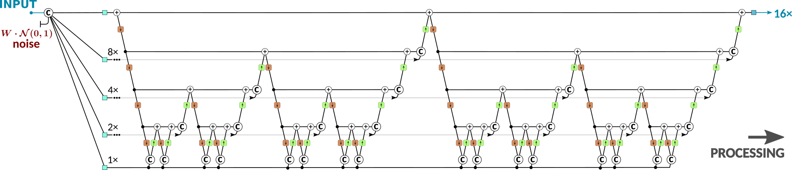

## Multi-Grid Back-Projection Networks

    

### Journal Paper

[Pablo Navarrete Michelini, Wenbin Chen, Hanwen Liu, Dan Zhu and Xingqun Jiang, "Multi-Grid Back-Projection Networks", in review, 2021.]()

### Conference Papers

[Pablo Navarrete Michelini, Wenbin Chen, Hanwen Liu and Dan Zhu, "MGBPv2: Scaling Up Multi-Grid Back-Projection Networks", in The IEEE International Conference on Computer Vision Workshops (ICCVW), 2019.](https://www.researchgate.net/publication/327979709_Multi-Scale_Recursive_and_Perception-Distortion_Controllable_Image_Super-Resolution)

[Pablo Navarrete Michelini, Hanwen Liu and Dan Zhu, "Multigrid Backprojection Super-Resolution and Deep Filter Visualization", to appear in the Thirty-Third AAAI Conference on Artificial Intelligence (AAAI-19)](https://www.researchgate.net/publication/327881763_Mutigrid_Backprojection_Super-Resolution_and_Deep_Filter_Visualization)

[Pablo Navarrete Michelini, Dan Zhu and Hanwen Liu, "Multi-Scale Recursive and Perception-Distortion Controllable Image Super-Resolution", in The European Conference on Computer Vision Workshops (ECCVW), 2018.](https://www.researchgate.net/publication/327979709_Multi-Scale_Recursive_and_Perception-Distortion_Controllable_Image_Super-Resolution)

#### BibTeX

    @article{MGBP,
        title     = {Multi--Grid Back--Projection Networks},
        author    = {Navarrete~Michelini, Pablo and Chen, Wenbin and Liu, Hanwen and Zhu, Dan and Jiang, Xingqun},
        booktitle = {},
        month     = {February},
        year      = {2021},
        url       = {}
    }

### REDS-4

- [4✕ REDS4 Validation](https://www.dropbox.com/s/pnheyf8bv6s6xqe/REDS4_validation_output.zip) (417.6MB)

### Vid3oC

- [16✕ Vid3oC Validation](https://www.dropbox.com/s/ctx6ewd5p64nl78/Vid3oC_validation_output.zip) (3.1GB)

### AIM-2020 (Test Set)

- [Fidelity **(2nd place)**](https://www.dropbox.com/s/few4dpe7g68mc60/BOE_Perceptual_SmoothMotion_AllFrames.zip) (2.8GB)
- [Perceptual **(4th place)**](https://www.dropbox.com/s/3vbx6wa6kc40irv/BOE_Perceptual_Texture_AllFrames.zip) (8.8GB)

### NTIRE-2020 Ouput Images

- [Track 1 **(3rd place)**](https://www.dropbox.com/s/kifkfg5d5zg12ga/Test_RC0.zip) (xxGB)

### AIM-2019 Output Images (DIV8K Test Set)

- [16✕ Test Set BOE-Perceptual **(1st place)**](https://www.dropbox.com/s/awmpxqv7myd8s99/BOE_Perceptual.zip) (11GB)
- [16✕ Test Set BOE-Fidelity **(5th place)**](https://www.dropbox.com/s/8iha5eezvuawh85/BOE_Fidelity.zip) (11GB)

### PIRM-2018 Output Images

- [4✕ Test set BOE-R3 **(2nd place)**](https://www.dropbox.com/s/72qep4yphv2pwe6/BOE-R3_PIRM2018-Test.zip) (63.2MB)
- [4✕ Test set BOE-R2 **(5th place)**](https://www.dropbox.com/s/b0gdutrn9p4o3wv/BOE-R2_PIRM2018-Test.zip) (48.8MB)
- [4✕ Test set BOE-R1 **(7th place)**](https://www.dropbox.com/s/5daanogz7a5j7ud/BOE-R1_PIRM2018-Test.zip) (45.3MB)

### Implementations

- [MGBP-3D](https://www.dropbox.com/s/eli02xwdgs8zt2q/BOE_Code_and_Models_Fidelity.zip) (196.6MB)
- [MGBP-v2](https://github.com/pnavarre/mgbpv2)
- [MGBP-v1](https://github.com/pnavarre/pirm-sr-2018)
